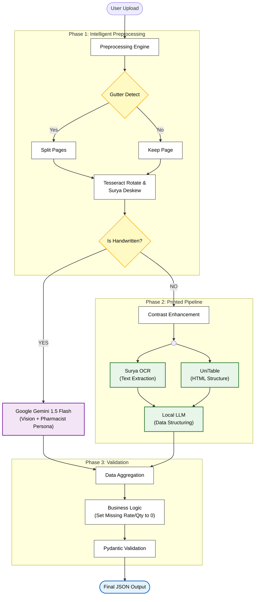
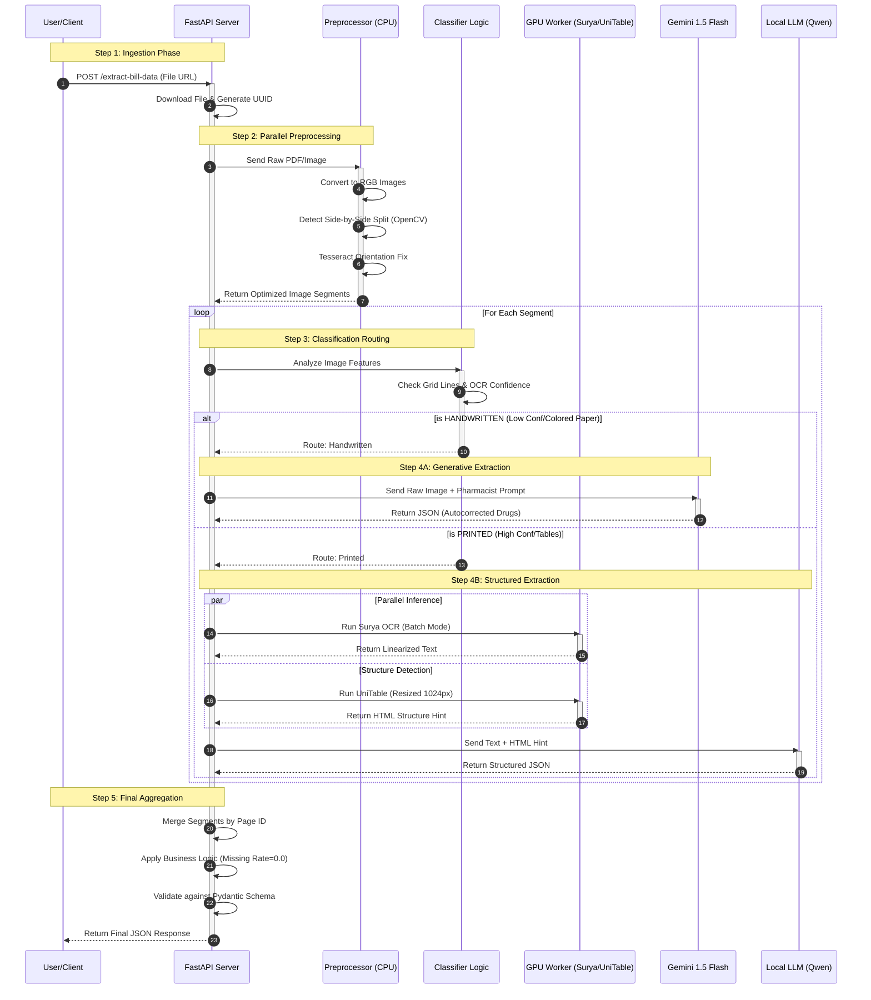

# 🧠 Intelligent Hybrid Pharmacy Bill Extractor  
### _A High-Accuracy Multimodal System for Extracting Structured Line Items from Medical & Pharmacy Bills_


---

# 📘 Overview

This project is a **highly accurate, production-grade Pharmacy Bill Extraction API** designed to process scanned invoices, hand-written prescriptions, medical bills, and multi-page PDFs.

It uses a **Hybrid AI Pipeline** that automatically decides:

| Document Type | Processing Path |
|--------------|------------------|
| 📝 Handwritten Bills | → Google Gemini Flash (Vision-Language Model) |
| 🖨️ Printed Bills | → Surya OCR + UniTable + Local LLM (Qwen 2.5) |

The system is **fault-tolerant**, **GPU accelerated**, **highly parallelized**, and uses **strict post-processing validation** rules to guarantee reliable structured output.

---

# 🚀 Key Features

### 🔍 1. Intelligent Document Routing  
Automatically classifies each page as **Handwritten** or **Printed** using:
- OCR Confidence (Tesseract)
- Hough Line Transform (Table/Grid detection)
- Color Saturation (Detect colored paper)
- Text density heuristics

### 🖼️ 2. Advanced Preprocessing Pipeline  
- Auto deskew  
- Auto rotation (OSD)
- Gutter detection → Split side-by-side scanned bills
- CLAHE contrast enhancement  
- Content-area cropping  
- Smart batch processing

### 🤖 3. Hybrid Extraction Engine  
#### **Handwritten Path (Generative Vision)**
- Google Gemini Flash Model Api
- Pharmacist persona prompt  
- Spelling correction for drug names  
- No hallucinated totals

#### **Printed Path (Structured AI)**
- Surya OCR for high-speed text recognition  
- UniTable for HTML structure extraction  
- Qwen 2.5 14B (local) for table-to-JSON transformation

### 🔒 4. Strong Normalization Layer  
- Cleans floats, currency, and inconsistent formatting  
- Rate/Quantity defaults to `0.0` when missing  
- Validated using Pydantic schemas

### 🛡️ 5. API-Ready & Production Optimized  
- FastAPI backend  
- Async IO everywhere  
- CUDA memory-safe  
- Automatic batch inference  
- Supports large PDFs  

---

# 🏗️ System Architecture



---

# 🔄 Data Flow Journey



---

# 📦 Prerequisites

### 🖥️ System Requirements
| Component | Requirement |
|----------|-------------|
| OS | Ubuntu / Windows / Mac |
| Python | 3.10+ |
| GPU | Recommended (NVIDIA 4GB+ VRAM) |
| Poppler | Required for PDF → Image |
| Tesseract | Required for OSD |


### 🔧 Install System Dependencies

#### **Ubuntu**
```bash
sudo apt-get install tesseract-ocr poppler-utils
```

#### **Windows**
Install:
- Tesseract OCR  
- Poppler for Windows  
(Add both to PATH)

---

# ⚙️ Installation

### 1. Clone the Repository
```bash
git clone https://github.com/yourusername/bill-extractor.git
cd bill-extractor
```

### 2. Create Virtual Environment
```bash
python -m venv venv
source venv/bin/activate      # Windows: venv\Scripts\activate
```

### 3. Install Dependencies
```bash
pip install fastapi uvicorn requests python-multipart pydantic pdf2image Pillow numpy opencv-python-headless json-repair
pip install torch==2.2.2 torchvision torchaudio --index-url https://download.pytorch.org/whl/cu118
pip install surya-ocr deskew scikit-image pytesseract
pip install transformers google-generativeai openai
```

### 4. Install UniTable (Local)
Put model weights here:

```
/unitable/experiments/unitable_weights/unitable_large_structure.pt
/unitable/experiments/unitable_weights/unitable_large_bbox.pt
/unitable/experiments/unitable_weights/unitable_large_content.pt
```

---

# 🔧 Configuration

Edit your `main.py`:

```python
GEMINI_API_KEY = "YOUR_KEY"
OCR_BATCH_SIZE = 4
PREPROCESS_WORKERS = 4
LOCAL_LLM_URL = "http://localhost:8000/v1"
```

---

# 🏃‍♂️ Running the Server

Start FastAPI server:

```bash
uvicorn main:app --host 0.0.0.0 --port 5000 --reload
```

---

# 📤 Example Request

```bash
curl -X POST "http://localhost:5000/extract-bill-data" \
     -H "Content-Type: application/json" \
     -d '{"document": "https://example.com/bill.pdf"}'
```

---

# 📦 API Response Structure

```json
{
  "is_success": true,
  "time_taken": 2.83,
  "data": {
    "pagewise": [
      {
        "page_no": "1",
        "page_type": "Bill",
        "bill_items": [
          {
            "item_name": "Shelcal 500",
            "item_amount": 95.0,
            "item_rate": 9.5,
            "item_quantity": 10
          }
        ]
      }
    ],
    "total_count": 1
  }
}
```

---

# 👨‍💻 Author
**Utsav**
